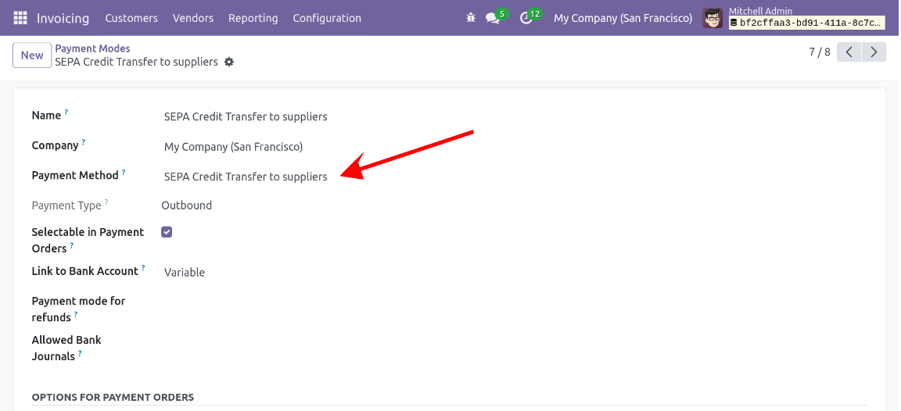

In the menu *Invoicing/Accounting \> Configuration \> Payment Modes*:
- create a Payment Mode dedicated to SEPA Credit Transfer.
- select the Payment Method *SEPA Credit Transfer to suppliers* (which is automatically created upon module installation).

- Check that this payment method uses the proper version of PAIN.

- The suppliers for which transfers will be made should have an IBAN with a country prefix in the [SEPA zone](https://en.wikipedia.org/wiki/Single_Euro_Payments_Area). 