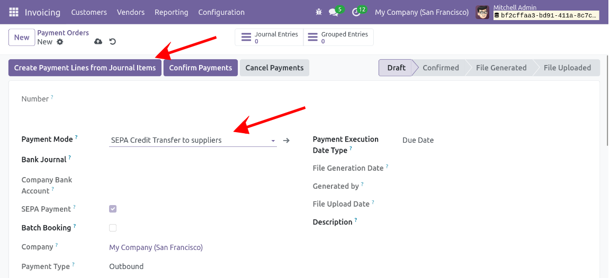
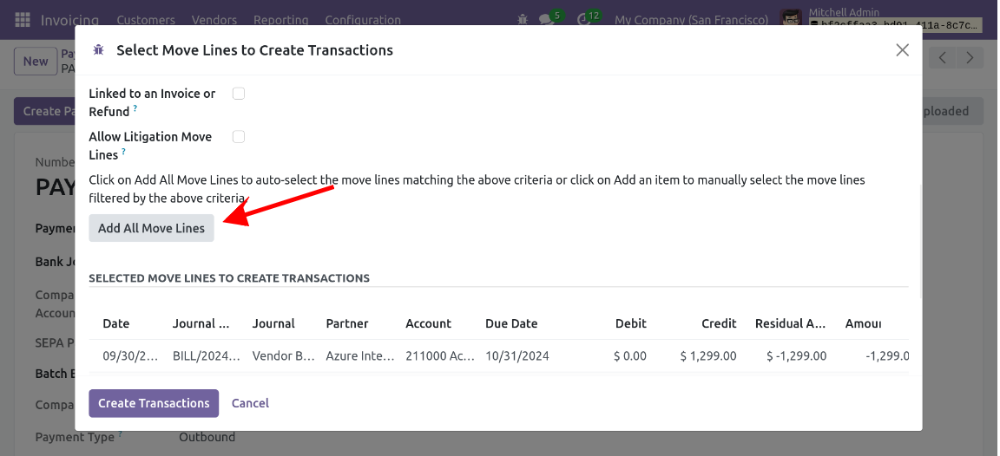

On the bills or the partners, set the configured payment modes.

In the menu *Invoicing/Accounting \> Vendors \> Payment Orders* :
- create a new payment order and select the configured payment mode

- set the due dates to filter the bills that are due
- click on Add All Moves Lines to add all the bills. 

- click on Create Transactions
